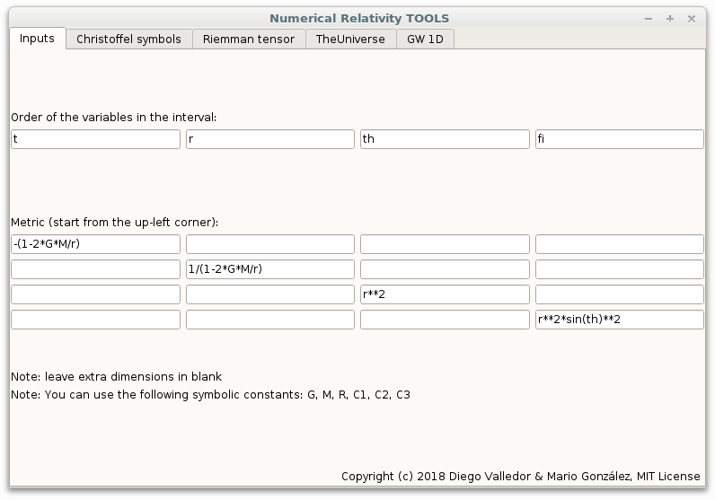
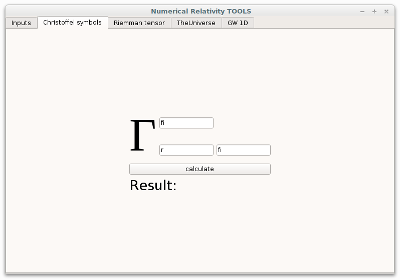
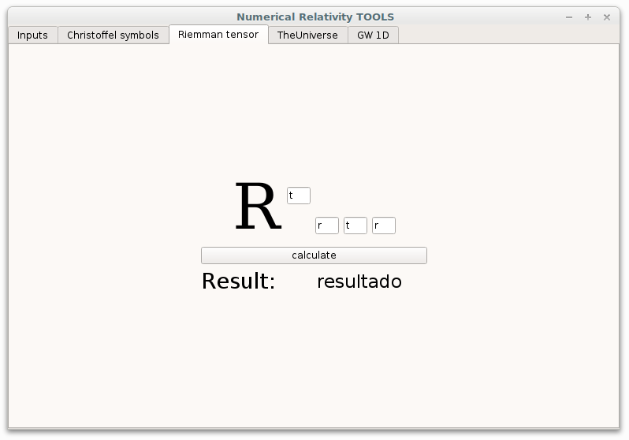
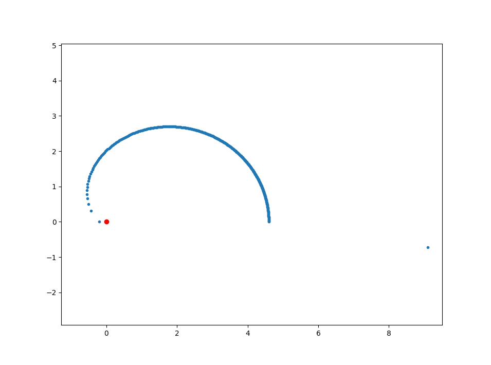
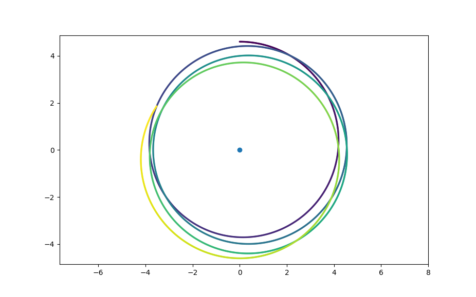
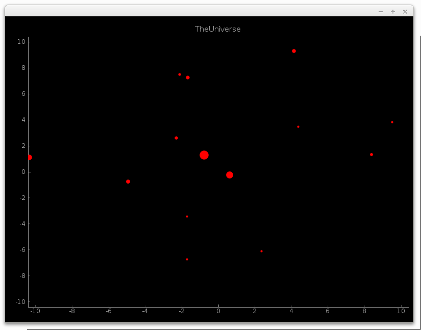

We will split the tutorial into two different sections, *Inside the interface*,
in which we will describe the usage of our application, and *Outside the
interface*, in which we will talk about the independent scripts.

====================
Inside the interface
====================

We will describe the main application in the first place. It is a *standalone*
widget that can be run either from Linux and Windows. Note that being a
*standalone* file means that it can be used **without any additional program**
installed. Although it has been built using python, neither python or any
other external software is necessary for running this widget.

The two first tools included in the widget are precisely a calculator to
compute both any Christoffel symbol and any component of the Riemann tensor. The
*ingredients* that we need in order to make those dishes are the matrix form of
the metric and the *order* of the differentials when we write the interval.

Note that this last consideration is necessary, since we will use the variables
both as variables (we will eventually derive with respect to them) and as
indexes, both in Christoffel's and Riemman's case.

----------------
The *Inputs* tab
----------------

Let's consider, for example, the Schwarzschild metric, 

.. math::

   -\left(1-\frac{2GM}{r}\right)dt^2 + \frac{1}{1-2GM/r}dr^2 + r^2d\theta^2 + r^2\sin(\theta)^2d^2\phi

the order of the variables in this expression will be *t*, *r*, *th* and *fi*
(note that we can not write math symbols in the application). then, we write
each element in :math:`g_{\mu\nu}`. In this case, only the blanks in the
diagonal are filled. the empty blanks are treated as zeros. If we want to work
with a (let's say) a 3D matrix, we should left empty the last row and column,
and the code will treat the case as a 3D metric, instead of a 4D one with a row
and a column of zeros. 

Note also that some common symbolic constants, like *G*, *M* and *R* are
pre-implemented in the code, so one can use them without any problem. 

If you need to use more constants, you can also type *C1*, *C2* and *C3*.

The following image illustrates how we should fill the *Inputs* section in the
Schwarzschild scenario.

.. _inputs:

   All the inputs are set in a proper way

.. note:: If your metric is so complex that you need *even more* symbolic
            constants than the ones provided, you can add them manually to the
            header of ``christ.py``. 

.. warning:: Make sure that you are not introducing wrong expressions or
                undefined variables in the metric. The program may crash if you
                do so.

Let's move now to the Christoffel symbols tab, and let's compute some of them.

-----------------------------
The *Christoffel symbols* tab
-----------------------------

we can calculate here any Christoffel symbol based on the data we have already
introduced. 

The interface is quite intuitive, so there is no need for further explanation.
Just enter the variables in the appropriate blanks and press
:guilabel:`calculate`. The result will show under the button.

.. christ:

   All the inputs are set in a proper way

.. warning:: Make sure that you are being consistent with the variables you
                used to define the metric.

-----------------------------
The *Riemann tensor* tab
-----------------------------

It works in the same way as the previous one. Note that, in order to calculate
any component of the Riemann tensor, one has to compute previously many
Christoffel symbols, so this widget may be bit slower. Anyway, the code is
optimized in the sense that it calculates every required symbol just in one
call to the *same* function that computes Christoffel symbols in the previous
tab. 

.. riemann:

   All the inputs are set in a proper way

-----------------------------
*TheUniverse* tab
-----------------------------

it simulates the evolution of many gravitational-attracted bodies computed with
einsteinMulti.cpp. Just choose the text file produced by the script and press
"Start!". The simulation will be opened in an external window. 

-----------------------------
*GW 1D* tab
-----------------------------

=====================
Outside the interface
=====================

Everything that is done *inside* the interface can be also done *outside*, by
using the following applications:

-----------------------------
christ.py
-----------------------------

It contains a function that can be called by looking at the commented example
at the end of the script. Here you can also add more constants if needed,
remember that this is also the function that is called from inside the widget. 
It returns :math:`\Gamma_{ab}^c`

.. code-block:: python

    def christoffel(ds, g_mn, abc = [], ABC = []):
        # computes \Gamma_{ab}^c. 

        # ABC contains multiple "abc" tuples. Use it if you want to compute
        # multiple symbols at once

        # abc = ['a', 'b', 'c'] is used if you only want to compute one symbol.

        #Constants that may appear in the metric
        G, M, R, C1, C2, C3 = sp.symbols('G M R C1 C2 C3')

-----------------------------
riem.py
-----------------------------

It contains a function that can be called by looking at the commented example
at the end of the script. Here you can also add more constants if needed,
remember that this is also the function that is called from inside the widget. 

It will return the component :math:`R^a_{bcd}` of the Riemann tensor.

.. code-block:: python

    def riemman(ds, g_mn, abcd):
        
        # computes R^a_{bcd} 
        
        # ds is a list containing the variables in the interval, in the correct
        # order

        # g_mn is the metric 
        
        # abcd = the indexes referring to the component of R that we want to
        # compute

-----------------------------
newtonMulti.py
-----------------------------

It does the same as newtonMulti.cpp. The code in python is more legible, but we
recommend to use it only if you haven't got any c++ compiler installed.
Otherwise, einsteinMulti.cpp will be much faster.  

-----------------
einsteinMulti.cpp
-----------------

**einsteinMulti.cpp**: Does the same as *newtonMulti*, but an option is
    added to perform the calculations with Swartchild potential, instead of
    newton's one. It is also much more optimized in terms of performance.

The basic options are:

    ``tmax``: The simulation time. The code will finish either if there is only
    one particle left (no more collisions remaining) or the simulation time is
    over).

    ``nObj``: The number of objects to simulate.

    ``dt``: the timestep. This variable is quite important, and is directly
    related to the accuracy of the code.

    In some cases, especially when using the Schwarzschild potential, one has to
    take care of this variable, in order to prevent situations like the one 
    in the following figure:

.. _orbitmal:

   an example of wrong timestep choice
   
   
   
The result is shown in figure :numref:`orbitmal` example denotes wrong parameters
in the code. At the beginning of the motion, the timestep is more than enough
to describe the orbit precisely, but as the *planet* approaches the *sun*, the
timestep becomes too big. In the closest point, the force is so strong that the
planet gains so much velocity and appears too far away from the sun in the next
iteration. Then, when the force is computed again, it is not strong enough to
stop the planet scaping from the sun at high velocity (a situation that is not
real).

Some suggestions to fix the code may be:

1.  Reduce the timestep. The timestep may be reduced drastically (see the
distance between the last and de penultimate positions). This will improve
accuracy, but will increase considerably the execution time.

2.  define a *collision radius*, and stop the simulation if the two objects
*collide*.

.. note:: This problem is even bigger in the relativistic case. The corrections
            made on Newton's potential decay as :math:`r^{-4}`, which is a
            minor correction at long distances, but bigger than Newton's
            :math:`r^{-2}` when :math:`r<1`.

-----------------
mercury.py
-----------------

It uses a simple correction to Newton's potential in order to show the
variation of Mercury's perihelium. As we saw, the precession is visible on the
plot (simulating the orbit only 2 periods) only when we the effect is
amplified by a factor of :math:`10^6`. In fact, as Einstein predicted, the
perihelium of Mercury rotates only 46'' per turn, too small for being seen in
our simulation. 

.. _mercury:

   the precession of Mercury, exaggerating the effects of General Relativity.

----------------
simulFromData.py
----------------

It uses the data produced with einsteinMulti.cpp or newtonMulti.py to build and
show the animation. It is written in Python, but uses ``pyqtgraph`` instead of
Matplotlib for showing the result. This choice was made for the sake of
performance. This file is also implemented in the widget.

.. _universe:

   a Screenshot of the simulation.

===================================================================
A gravitational pulse in a 2-dimensional simplified space-time(t,x)
===================================================================

The program "gravitational-wave" aims to perform a numerical calculation of the
intensity of the field induced by a 1-dimensional gravitational wave using the
*3+1 formalism* of the General Relativity. 

The *3+1 formalism* is based on the decomposition of space-time into
3-dimensional hyper-surfaces with *t = constant*. This can be seen as a
foliation, we can superimpose infinite hyper-planes (3-dimensional) to generate
a complete 4-dimensional space. It is only necessary that the *leaves* do not
intersect each other. A space that meets this condition is said to be a
*globally hyperbolic space*, and implies that there are no closed timelines
(you cannot travel backwards in time). 

The program solves the relativistic wave equation that in a general space takes the form 

.. _dalambert:
.. math::

    \square\Phi = 0

where

.. RelWave:
.. math::

    \square\Phi = \frac{1}{\sqrt{-g}}\partial_{\mu}        \left( \sqrt{-gg^{\mu\nu}}\partial_{\nu}\Phi \right)

:math:`\Phi` is the gravitational field. We are going to solve the relativistic
wave equation in 1-spatial dimension, so :math:`\Phi = \Phi(t,x)`

Let's now take a look *inside* the program. It runs in FORTRAN90(.f90). It is
structured in several nested routines using only 2 Fortran modules:
"arrays.f90" and "global.f90". It contains the following scripts:

-------
Modules
-------

    **arrays.f90**: Defines some global variables and dimensional arrangements.

    **global.f90**: declares scalar variables that are used in all program
    routines.

---------------
**Subroutines**
---------------

    **main.f90**: it is the "traditional" first file. Starts the program and
    manages the parameters and variables. Use "global.f90" module.

    **principal.f90**: the "core" of the program. Use "arrays.f90" and
    "global.f90", call secundaries subroutines (like memory asignament), and
    checks and saves the progress.

    **memory.f90**: memory assignment for numerical variables. It uses
    "arrays.f90" and "global.f90". This subroutine is necessary for the
    compilation, but it is not important for the numerical calculation (it only
    assigns space of memory to the allocated variables)

    **mesh.f90**: this subroutine generates the division of the space and the
    temporal coordinates, and defines the minimum units of separation to
    discretize space and time. Uses "arrays.f90" and "global.f90"

    **initial.f90**: calculates the parameters of the adapted coordinates
    according to the defined metric in the spacetime we intended to simulate.
    In this case, only *Minkowski* and *Schwarzschild* metrics are implemented,
    so this subroutine needs only to know the parameters of the Schwarzschild
    metric. It defines the pulse of the wave (in this case, Gaussian pulse) and
    then calls "constriction_calc.f90" to solve the constriction equations
    (energy and momentum). Uses "arrays.f90" and "global.f90".

    **constriction_calc.f90**: solves the constriction equations for the
    initial parameters using the *finite differences* method, calculating the
    central difference and then the forward and backward differences. Uses
    "arrays.f90" and "global.f90".

    **save_arrays.f90**: this subroutine is not really important, it only saves
    the results in ".x" extesion files, using a couple of tuples :math:`(x,
    \Phi(x))` for each timestep (it doesn't save all time iterations, only
    under several conditions). Uses "arrays.f90" and "global.f90".

    **RangKut3.f90**: This is the core of the numerical calculation.
    Previously, we need the values of :math:`\Phi(x)` in each point, calling
    "numeric.f90". It Solves the evolution equations using the *Range-Kuta*
    method. A third RK order is enough to guarantee the convergence of the
    method. We need to re-solve the constriction in each iteration. Also,
    this subroutine calls "boundaries_calc.f90". Uses "arrays.f90" and
    "global.f90".

    **numeric.f90**: Calculates the evolution of the fields using *second order
    finite differences* method. Similar to "constriction_calc*. Uses
    "arrays.f90" and "global.f90".

    **boundaries.f90**: implemented the boundary conditions. Absorption,
    reflexion, periodic and black hole conditions. It is possible that we need
    to improve this subroutine.

----------------------
**Installation guide**
----------------------

For the moment, we will include just the instructions for based Linux SO.

1.  Install the libraries of FORTRAN90: 

2.  Install a Fortran compiler:

        **Archlinux**: ``sudo pacman -S gfortran`` 

        **Debian/Ubuntu**: ``sudo apt-get install gfortran``

        **Fedora**: ``su -c dnf install fcc-gfortran``

3.  To compile the code, use the *Makefile* file. Once located at the directory
    where the *Makefile* is, type *make* on the terminal (maybe you have to install
    the *make* command first). To compile the code manually you need to introduce

.. code-block:: bash

    gfortran -std=f95 file1.f90 file2.f90 (...) fileN.f90 -o executable_name. 

4.  In order to visualize the graphics, you can use *gnuplot* ore similar.

We recommend using the app included in our repository to execute and visualize all
the results.
